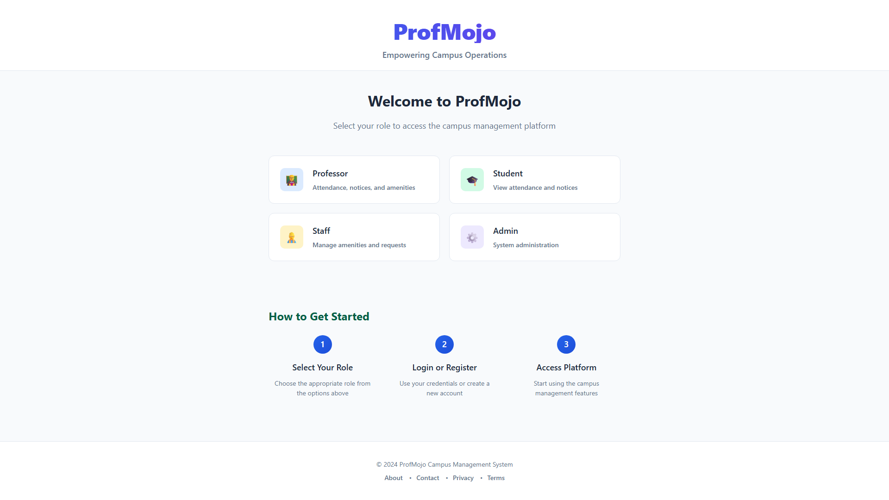
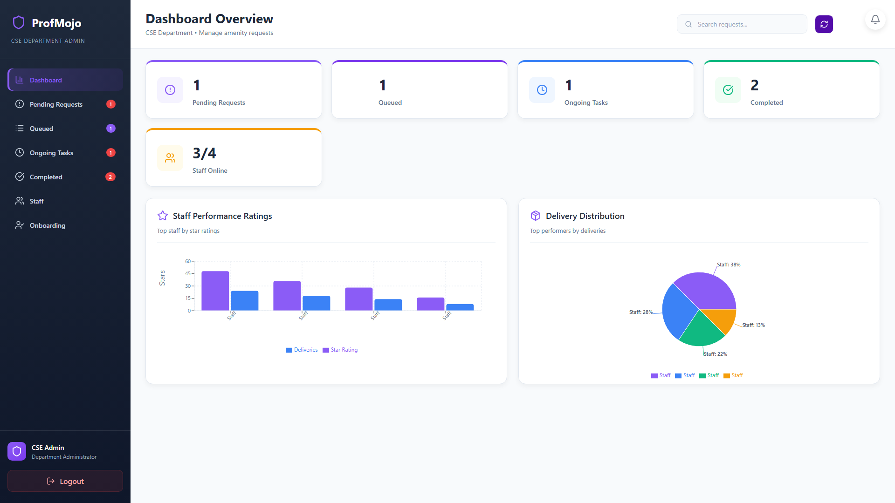
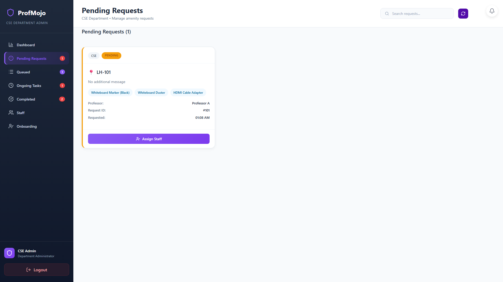
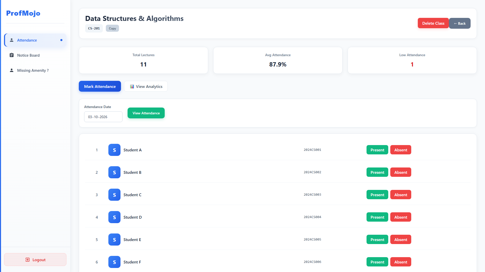
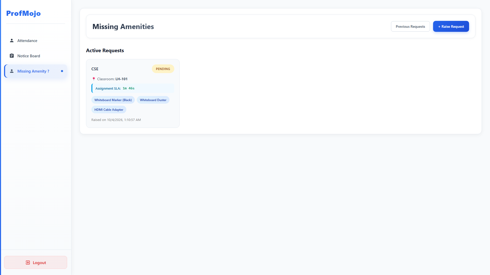
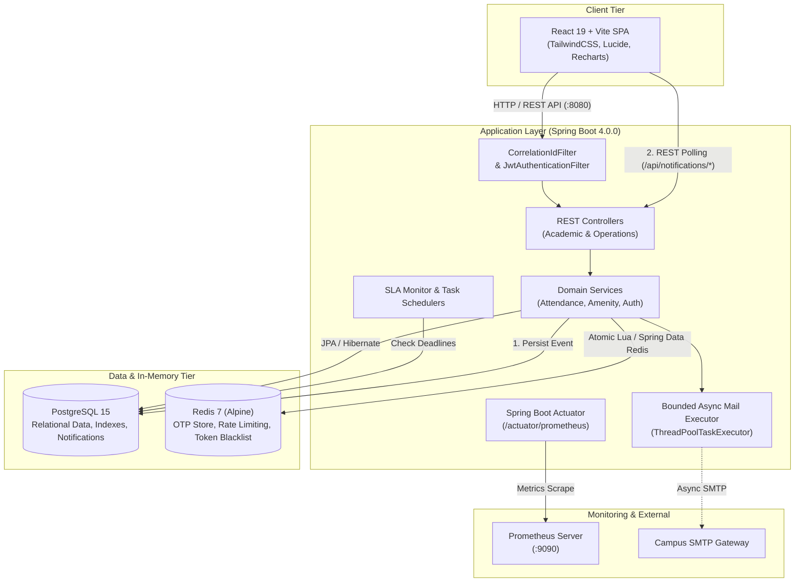
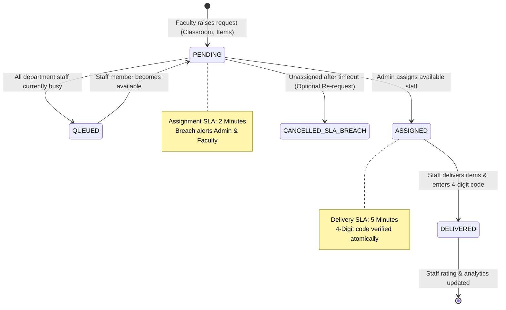

# ProfMojo

> Campus operations management platform for academic workflows, attendance, notices, and SLA-driven amenity fulfillment.

[](https://github.com/RISHABHXVAZ/ProfMojo/releases/tag/v1.0.0)
[](https://openjdk.org/projects/jdk/17/)
[](https://spring.io/projects/spring-boot)
[](https://react.dev/)
[](https://www.postgresql.org/)
[](https://redis.io/)
[](https://www.docker.com/)

ProfMojo is an enterprise-grade campus operations and facility management platform. It bridges the gap between academic administration (course enrollment, daily attendance tracking, student analytics, notice distribution) and operational facility logistics (SLA-governed classroom amenity fulfillment, atomic staff assignment via PostgreSQL row-level locks, and delivery analytics).

---

## Screenshots

### Platform

*Role-selection landing page providing segregated entry points for Professors, Students, Staff, and Administrators.*

### Admin Operations

*Admin operations center displaying real-time queue metrics, staff availability, star ratings, and delivery distribution analytics.*

### Amenity Workflow

*Administrator pending requests view showing classroom locations, requested facility items, requesting faculty, and assignment actions.*

### Academic Management

*Professor course roster showing lecture statistics, average attendance, low-attendance alerts, and real-time attendance controls.*

### SLA-driven Fulfillment

*Missing amenities interface featuring active countdown timers governed by campus service-level agreements.*

---

## What is ProfMojo?

Modern educational institutions frequently suffer from operational fragmentation:
1. **Academic Friction**: Faculty rely on manual registers or disconnected portals for student attendance and announcements, leading to delayed academic intervention.
2. **Facility Disruptions**: Lectures are disrupted when critical classroom equipment (projector remotes, whiteboard markers, HDMI adapters) goes missing, with no accountable mechanism to dispatch help under strict time constraints.

ProfMojo resolves both challenges through a single, secure, role-based platform covering two operational domains:
- **Academic Management**: Empowers professors to manage courses, record attendance with rapid undo safeguards, track student trends, and broadcast announcements.
- **Campus Amenity Operations**: Implements a FIFO-prioritized, SLA-tracked logistics workflow where classroom amenity requests are dispatched, assigned atomically to staff, and verified via one-time delivery codes.

### Role-Based Access
- **Professor**: Manages classes, tracks attendance, publishes targeted class notices, and raises urgent classroom amenity requests with live SLA timers.
- **Student**: Tracks personal attendance percentages across enrolled courses and views real-time academic notices.
- **Staff**: Manages active amenity delivery tasks, updates availability status, and validates deliveries via professor confirmation codes.
- **Department Admin**: Oversees department queues, assigns staff members atomically, monitors SLA health, manages user onboarding, and audits staff performance.

---

## Core Features

### Academic Management
- **Course Lifecycle**: Self-service classroom creation with auto-generated enrollment codes for student self-registration.
- **Attendance Tracking**: Rapid daily attendance marking with interactive status pills and a 5-second undo window for accidental entries.
- **Attendance Analytics**: Automated calculation of total lectures, class average attendance, and warning indicators for students falling below the 75% attendance threshold.
- **Multi-Class Notices**: Broadcast announcements across single or multiple enrolled classes simultaneously.

### Amenity Operations
- **Urgent Facility Requests**: Faculty can request missing classroom items (markers, dusters, adapters, power strips) with automated classroom mapping.
- **FIFO Request Queue**: Requests enter a department-scoped queue prioritized by arrival time.
- **Atomic Staff Dispatch**: Thread-safe staff assignment protected by database row locks to prevent double-booking.
- **Dual-Stage SLA Governance**:
  - *Assignment SLA*: Strict 2-minute window for administrators to assign available staff.
  - *Delivery SLA*: Strict 5-minute delivery window for assigned staff to deliver items.
- **Delivery Confirmation Codes**: Secure 4-digit verification code held by the requesting professor to confirm delivery completion.
- **Staff Performance Tracking**: Cumulative delivery counters and star ratings visualized through bar and distribution charts.
- **Persistent In-App Notifications**: Departmental notifications stored in PostgreSQL and delivered via client-side REST polling.

### Platform Engineering
- **Stateless Authentication**: HMAC-SHA256 signed JWT tokens with externalized secrets and claim-based authorization.
- **Resilient Multi-Tier OTP Store**: Primary storage in Redis with automatic persistence fallback to PostgreSQL.
- **Atomic Token Revocation**: Unique `jti` token blacklisting in Redis with TTL synchronized to token expiration.
- **Dual-Dimension Rate Limiting**: IP-based and user-targeted rate limiting enforced via atomic Redis Lua scripts.
- **Bounded Async Email Pipeline**: Dedicated thread pool executor isolating SMTP latency from HTTP request threads.
- **Structured Correlation IDs**: `CorrelationIdFilter` propagating `X-Correlation-ID` across HTTP headers, logs, and error responses.
- **Production Observability**: Spring Boot Actuator health probes and Prometheus metrics export.
- **Turnkey Containerization**: Complete multi-container deployment orchestrated via Docker Compose.

---

## Architecture

ProfMojo is built as a modular multi-tier architecture containerized with Docker Compose. All asynchronous notification delivery operates via backend event persistence and client-side REST polling.



---

## Engineering Highlights

### 1. Concurrency Control with Row-Level Locking
To prevent race conditions where concurrent administrators or automated dispatchers assign the same staff member to multiple overlapping amenity deliveries, staff assignment operations utilize PostgreSQL row-level locks:
```sql
SELECT s FROM Staff s WHERE s.available = true AND s.department = :dept FOR UPDATE SKIP LOCKED
```
This guarantees strict serializability and zero double-assignment under high concurrent load.

### 2. Elimination of N+1 Query Cascades
Entity relationships across classes, enrollments, attendance records, and amenity items were systematically audited and optimized:
- Replaced lazy collection iterations with dedicated projection DTOs (`AmenityResponseDTO`).
- Applied `@BatchSize` and JPA `JOIN FETCH` directives across notice-to-class mappings.
- Reduced database round-trips from $O(N)$ query loops down to single-query index lookups.

### 3. Resilient Multi-Tier OTP Store
To ensure critical authentication flows (such as admin login and password verification) succeed even during temporary cache restarts:
- Primary OTP generation writes to Redis with a 5-minute TTL.
- In the event of a Redis connection exception, the authentication engine transparently fails over to PostgreSQL's `onboarding_otp` table without dropping user requests.

### 4. Atomic Rate Limiting via Redis Lua Scripts
Authentication and sensitive OTP endpoints are safeguarded against brute-force attacks using atomic Redis Lua scripts evaluating dual dimensions:
- **IP Dimension**: Max 3 requests per 60-second window.
- **User Dimension**: Max 2 requests per 300-second window.
Executing checks via Lua ensures atomic read-increment-expire operations without application-level distributed locks.

### 5. Stateless JWT Revocation with JTI Blacklisting
Standard JWTs cannot be revoked before expiration without maintaining state. ProfMojo assigns a unique UUID `jti` (JWT ID) claim to every minted token. Upon logout:
- The token's `jti` is inserted into Redis with an exact TTL matching the token's remaining lifespan.
- `JwtAuthenticationFilter` validates token signatures and checks Redis revocation in sub-millisecond memory lookups.

### 6. Bounded Asynchronous Email Pipeline
Email notifications for OTP delivery and facility updates are executed on a dedicated `mailTaskExecutor`:
- Configured as a bounded executor with core pool 2 (`corePoolSize=2`), max pool 5 (`maxPoolSize=5`), and queue capacity 50.
- Rejection policy set to `AbortPolicy` (`ThreadPoolExecutor.AbortPolicy`) when the executor is saturated.

### 7. Strategic Database Indexing
High-frequency query paths are backed by explicit B-tree database indexes:
- `idx_amenity_fifo_queue`: Composite index on `(department, status, created_at)` optimizing FIFO queue scans.
- `idx_enrollment_student`: Index on `student_reg_no` optimizing student dashboard lookups.
- `idx_attendance_class_date`: Compound unique index on `(class_code, student_reg_no, attendance_date)`.
- `idx_amenity_sla_active`: Partial index on `sla_deadline` for pending/assigned records.

### 8. End-to-End Distributed Tracing
`CorrelationIdFilter` inspects incoming HTTP requests for an `X-Correlation-ID` header, generating a unique UUID if absent. The identifier is bound to the SLF4J Mapped Diagnostic Context (MDC), ensuring that all logs, database operations, async mail delivery threads, and error responses share an identical correlation footprint.

---

## Request & Amenity Lifecycle

The amenity management workflow tracks physical classroom requests through a deterministic finite state machine governed by automated SLA monitors:



---

## Security

ProfMojo implements defensive security controls across all application tiers:
- **Role-Based Access Control (RBAC)**: Enforced via Spring Security with explicit endpoint boundaries for `ROLE_STUDENT`, `ROLE_PROFESSOR`, `ROLE_STAFF`, and `ROLE_ADMIN`.
- **HMAC-SHA256 Token Security**: Tokens signed with 256-bit secret keys enforced at container startup.
- **Department-Level Isolation**: Administrators and facility personnel can only view and mutate records associated with their assigned academic department.
- **Header Spoofing Mitigation**: Rate-limiting proxy header evaluation (`trust-proxy-headers`) defaults to `false`, relying on direct TCP remote addresses unless explicitly deployed behind a trusted reverse proxy.
- **Restricted Actuator Surface**: Sensitive actuator endpoints are disabled in production; only `health`, `info`, and `prometheus` endpoints are exposed.
- **Zero Committed Secrets**: All credentials and sensitive tokens are externalized into environment variables via `.env`.

---

## Observability

The application stack includes enterprise observability hooks:
- **Health Probes**: Liveness and readiness endpoints available at `/actuator/health` for orchestrator probes.
- **Prometheus Scraping**: Native Micrometer metrics published at `/actuator/prometheus` and polled by the included Prometheus container (`:9090`).
- **Connection Pool Monitoring**: Continuous telemetry on HikariCP active connections, idle connections, pending threads, and connection timeout rates.
- **Operational Metrics**: Custom gauges and counters tracking active SLA breaches, completed deliveries, and queue depth.
- **Structured Error Responses**: Standardized JSON error schema containing HTTP status, timestamp, correlation ID, and sanitised error messages.

---

## Testing & Quality Assurance

ProfMojo enforces strict test discipline validated through automated unit, integration, and end-to-end test suites:

```text
======================================================
TEST RESULTS SUMMARY
======================================================
Tests Run:       149
Failures:        0
Errors:          0
Skipped:         0
Success Rate:    100%
======================================================
Live Docker E2E: 10/10 Flows Verified
======================================================
```

### Verified Test Categories
- **Concurrency Test Suites**: Validated multi-threaded staff assignment under high contention with zero duplicate assignments.
- **Security & RBAC Suites**: Verified unauthorized endpoint rejections, expired token handling, and JTI blacklist filtering.
- **Rate Limiting Suites**: Validated Redis Lua token bucket behavior across IP and user dimensions.
- **Repository & Query Tests**: Verified custom JPQL queries, composite indexes, and batch fetch limits.
- **Docker E2E Suites**: 10 comprehensive multi-role integration flows executed against live PostgreSQL, Redis, backend, and frontend containers.

---

## Tech Stack

| Domain | Technologies |
|---|---|
| **Frontend** | React 19, Vite, JavaScript (ES6+), Axios, Lucide React, Recharts |
| **Backend** | Java 17, Spring Boot 4.0.0, Spring Security 6, Spring Data JPA, Hibernate 6 |
| **Data & Cache** | PostgreSQL 15, Redis 7 (Alpine) |
| **Observability** | Prometheus, Spring Boot Actuator, Micrometer, SLF4J / Logback (MDC) |
| **Infrastructure** | Docker, Docker Compose |
| **Testing** | JUnit 5, Mockito, MockMvc, AssertJ |

---

## Local Setup

### Prerequisites
- [Git](https://git-scm.com/)
- [Docker Desktop](https://www.docker.com/products/docker-desktop/) (running with Docker Compose enabled)

*(No local Java, Node.js, PostgreSQL, or Redis installations are required when running via Docker).*

### 1. Clone the Repository
```bash
git clone https://github.com/RISHABHXVAZ/ProfMojo.git
cd ProfMojo
```

### 2. Configure Environment Variables
Copy the root `.env.example` file to `.env`:

**Linux / macOS (Bash):**
```bash
cp .env.example .env
```

**Windows (PowerShell):**
```powershell
Copy-Item .env.example .env
```

Open `.env` in any editor and ensure the required variables are set:
- `JWT_SECRET`: Secret key for HMAC-SHA256 signing (minimum 32 characters).
- `REDIS_PASSWORD`: Secure password for the Redis container.
- `ADMIN_DEPARTMENT_SEEDS`: Initial department admin seed (`DEPARTMENT:EMAIL:SECRET_KEY`).
- `MAIL_USERNAME` / `MAIL_PASSWORD`: Optional SMTP credentials (falls back to mock delivery if empty).

### 3. Build and Start Services
Launch all services using Docker Compose:
```bash
docker compose up --build
```

### 4. Service Ports
Once the containers report healthy:

| Service | URL | Notes |
|---|---|---|
| **Frontend Web App** | [http://localhost:5173](http://localhost:5173) | Single-page application |
| **Backend REST API** | [http://localhost:8080](http://localhost:8080) | Spring Boot application |
| **Actuator Health** | [http://localhost:8080/actuator/health](http://localhost:8080/actuator/health) | Health & readiness checks |
| **Prometheus Dashboard** | [http://localhost:9090](http://localhost:9090) | Metrics & system scrape targets |
| **PostgreSQL Database** | `localhost:5433` | Host port mapped to internal `5432` |

To stop the containers:
```bash
docker compose down
```

---

## Project Status

**ProfMojo v1.0.0** is an engineering-complete, production-audited portfolio release. All backend test suites, security configurations, database indexes, and end-to-end containerized workflows have been fully validated.
